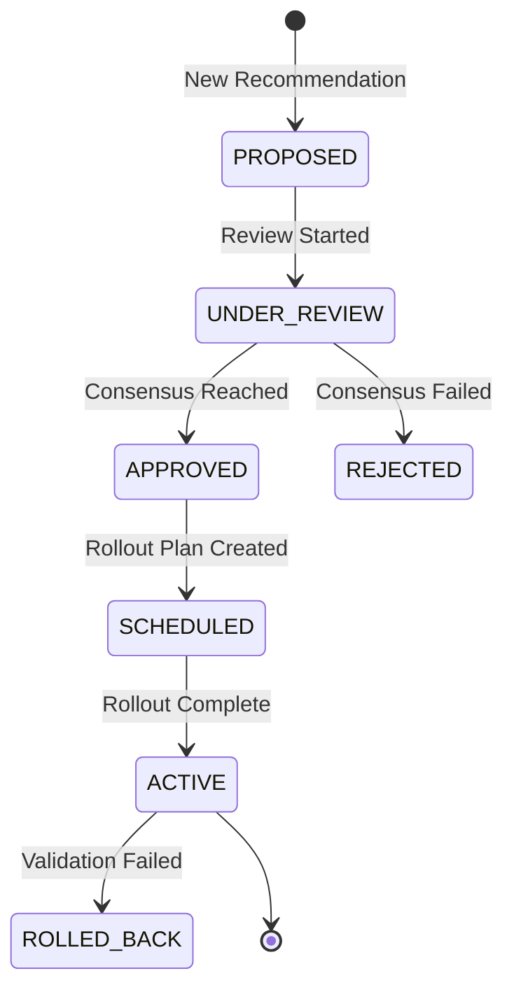
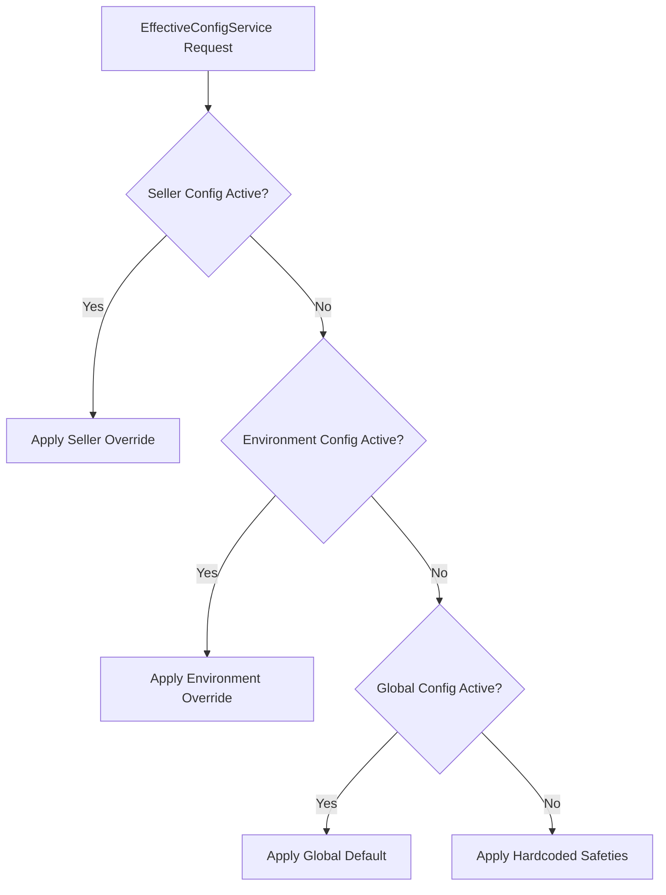

# Project v1 Walkthrough & Architecture Flow

## Overview
Project v1 introduces a fully autonomous closed-loop system for operations management. It automatically detects issues, isolates root causes, formulates configuration improvements, and safely rolls out those changes across the environment.

## Architecture Flow
The architecture is designed sequentially across distinct phases, each feeding into the next:

1. **Incident Detection (Phase K)**
   - Metrics are gathered and anomalies are flagged as Incidents.
2. **Ops Policy Enforcement (Phase N)**
   - Configurable rules define thresholds for interventions (e.g., blocking a bad deployment or throttling a seller).
3. **Learning & Root Cause Analysis (Phase O)**
   - Upon incident resolution, the system uses "5 Whys" methodologies to build an RCA. It clusters similar RCAs to identify systemic issues.
4. **Change Management & Auto-Remediation (Phase P)**
   - Identifications from Phase O are converted into `LearningRecommendation`s, which map to actionable `ChangeProposal`s.
   - Proposals are peer-reviewed.
   - Approved proposals generate new `ConfigVersion`s.
   - `RolloutPlan`s apply these configurations safely.

## Component Lifecycle Diagrams

### Change Management Lifecycle

### Configuration Precedence Model

## User Interfaces
Operators interact with the system via two distinct interfaces:
1. **Admin Web Dashboard**: Visual representations of the Review Queue, System Impact, and Active Configs.
2. **Admin CLI**: Raw access via `ops change propose`, `ops change approve`, and `ops change effective-config`.

**Project v1 is fully complete and operational.**
