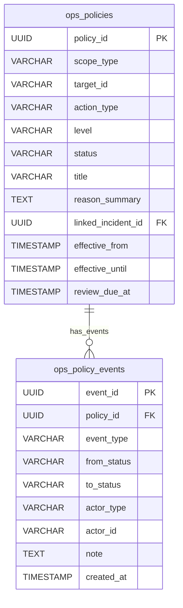

# Phase N: Seller Ops Policy Implementation
**Status:** Completed (Wave 1 - Wave 6)

## 1. Architecture Overview
Ops Policy Layer は、Seller (および他のスコープ) 向けに、システムの一時的な制限やアクションを管理・適用するための仕組みです。
- **Core Domain:** `OpsPolicy`, `OpsPolicyEvent`, `OpsPolicyCandidate`, `EffectivePolicy`
- **Services:**
  - `IncidentDetectionService`: 異常検知と候補抽出
  - `OpsPolicyManagementService`: ポリシーの CRUD と状態遷移
  - `EffectivePolicyService`: キャッシュを利用した現行の有効ポリシーの即時判定
  - `OpsPolicyStateMachine`: 厳格な状態遷移管理
  - `OpsPolicyDashboardService` / `OpsPolicyDigestService`: 可視化・レポート
- **Presentation:** CLI (`admin_cli`) と Web UI (`admin_web`)
- **Persistence:** SQLAlchemy ORM / PostgreSQL JSONB 拡張付き DB

## 2. Use Cases Covered
- **候補自動生成:** SLA遅延や大量アラートから、自動的に適用すべきポリシー候補をオペレータへ提案します。
- **ポリシー強制 / Overlay:** Strong レベルで強制遮断したり、Overlay レベルで部分的な制限を加えたりできます。
- **監査と証跡:** すべてのポリシー変更は `ops_policy_events` テーブルに追記専用 (Append-only) で永続化され、誰が・いつ・なぜ操作したかが完全に追跡可能です。

## 3. API Reference (Services)
- `OpsPolicyManagementService`:
  - `create_manual_policy()`, `create_policy_from_candidate()`
  - `update_policy_status()`, `add_policy_note()`
- `EffectivePolicyService`:
  - `get_effective_policies(target_id, scope_type)`
  - `evaluate_action(target_id, action_type)`
- `IncidentDetectionService`:
  - `scan_all_candidates()`

## 4. CLI Command Reference
- `ops policy scan`
- `ops policy list --status=active --scope=seller`
- `ops policy show --policy-id=<uuid>`
- `ops policy propose --action=block_live_execution ...`
- `ops policy approve / activate / release / reject / cancel`
- `ops policy dashboard`
- `ops policy digest --type=active`

## 5. Web Route Reference
- `GET /ops/policies/`
- `GET /ops/policies/<id>`
- `GET /ops/policies/dashboard`
- `GET /ops/policies/candidates`
- `GET/POST /ops/policies/create`
- `POST /ops/policies/<id>/approve` (and other state transitions)

## 6. Orchestrator Job Reference
- `policy_candidate_scan_job`: 定期的に候補をスキャンしログ・アラートへ出力
- `policy_expiry_job`: `effective_until` を超過したポリシーを自動的に `EXPIRED` 化
- `policy_review_due_scan_job`: レビュー期限の過ぎた `APPROVED` ポリシーを検出

## 7. DB Schema Diagram

## 8. Integration Points with Phase M (Incidents)
- OpsPolicy の `linked_incident_id` を用いて、Phase M の Incident と紐付きます。
- `IncidentDetectionService` により、特定の重度 Incident から自動的に Policy Candidate が提案されます。

## 9. Future Extensions (Out of Scope for Phase N)
- **External ticket integration:** JIRA 等との連携
- **Auto-remediation execution:** ポリシーによる自動修復
- **Advanced ML scoring:** アラート群からの ML 予測ベースの提案
- **Full RBAC/SSO:** 厳格なアクセス制御
