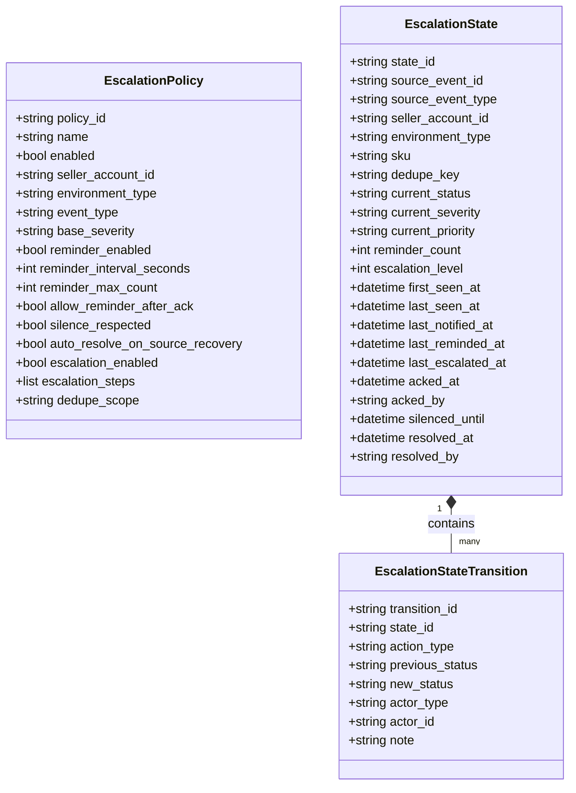

# Escalation & Reminder Layer Design Spec v0.1

This document specifies the design for the **Escalation / Reminder Layer** as an extension to the existing Alert / Notification Layer. It provides active tracking of unresolved critical operational events, periodic reminding, and priority/channel escalation.

---

## 1. Objectives & Scope

### Purpose
To close the operational gap where critical alerts are sent once and then lost/forgotten. This layer tracks unresolved events, periodically issues reminders, escalates severity or notification channels when conditions are met, and provides operational controls (Ack, Silence, Resolve) via CLI and Web interfaces.

### Scope
1. **Unresolved Event Tracking**: Normalizing notifications/jobs/system issues into distinct `EscalationState` entities.
2. **Flexible Rules**: Evaluating policies based on Seller account, Environment, Event Type, and Severity.
3. **Operational State Machine**: open ⇄ acknowledged ⇄ silenced ⇄ escalated ⇄ resolved ⇄ closed.
4. **Reminder Logic**: Cooldown checks, max count controls, and Ack-respect checks.
5. **Escalation Steps**: Progressive level upgrades after configured durations, continuous repeat counts, or un-acked states.
6. **Integrations**: CLI Command integration, Web dashboard integration, and Scheduled Orchestrator task execution.
7. **Security**: Mandatory masking of all access tokens, credentials, and raw webhook targets.

---

## 2. Domain & DB Architecture



### Table Schema Mappings
We will define three new tables in the database:
1. `escalation_states`: Tracks active unresolved issues.
2. `escalation_state_transitions`: Audit trail of status changes (e.g. Ack, Silence, Resolve).
3. `escalation_policies`: Configured policies for reminders and escalations.

---

## 3. Core Engine Components

```
                +-------------------------------------------------+
                |            Notification / System Events         |
                +-----------------------+-------------------------+
                                        |
                                        v
                        +-------------------------------+
                        |   EscalationEventNormalizer   |
                        +---------------+---------------+
                                        |
                                        v
                        +-------------------------------+
                        |    UnresolvedEventSelector    |
                        +---------------+---------------+
                                        |
                                        v
                        +-------------------------------+
                        |    Reminder/Escalation Engine |
                        +---------------+---------------+
                                        |
                 +----------------------+----------------------+
                 |                                             |
                 v                                             v
     +-----------------------+                     +-----------------------+
     |   ReminderDispatcher  |                     |  EscalationDispatcher |
     +-----------+-----------+                     +-----------+-----------+
                 |                                             |
                 +----------------------+----------------------+
                                        |
                                        v
                        +-------------------------------+
                        |      Notification Layer       |
                        +-------------------------------+
```

1. **`EscalationEventNormalizer`**: Standardizes diverse events (job runs, doctor checks, notifications) into uniform input records.
2. **`UnresolvedEventSelector`**: Filters active database events and queries recovery logs to automatically clear resolved states.
3. **`ReminderDecisionEngine` & `EscalationDecisionEngine`**: Evaluates policy-specific criteria, checking silence durations, elapsed steps, repeat counts, and ack-respect configs.
4. **`AckResolveService`**: Manages manual changes (Ack, Silence, Resolve, Reopen) with actor auditing.
5. **`ReminderDispatcher` & `EscalationDispatcher`**: Relays alerts to the Notification Layer using standard formatting and prepends `[REMINDER]` or `[ESCALATED]` tags.

---

## 4. State Transitions

* **`open`**: Unresolved, undergoing periodic checks.
* **`acknowledged`**: Received by operator. Policy may allow warning reminders to continue or halt.
* **`silenced`**: Suspended until a specific datetime passes.
* **`escalated`**: Promoted to higher severity/channels.
* **`resolved`**: Cleared. Discarded from active evaluation.

---

## 5. Implementation Strategy

1. **DB Updates**: Add schema models in `src/db/models.py` and run metadata reflection.
2. **Repositories**: Implement `PersistentEscalationStateRepository` and policies.
3. **Core Services**: Write engines, resolvers, and dispatchers.
4. **CLI / Web Integrations**: Connect routing view widgets, actions, and terminal arguments.
5. **Tests**: Add comprehensive coverage in `tests/test_escalation_reminder_layer.py` and associated files.
