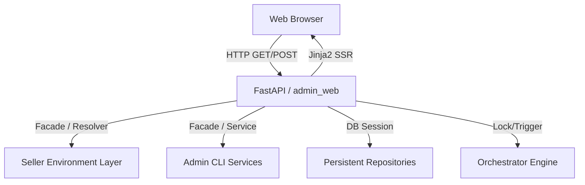

# Lightweight Admin Web View 設計書 v0.1

## 1. 目的
本設計書は、既存の `Collection / Research / Listing Readiness / Listing Execution / Monitoring / Revise / Listing Sync / Recovery / Scheduled Orchestrator / Admin / Ops CLI / Persistence / Auth / Notification / Seller Environment Management` の各業務ロジックを再実装することなく、Webブラウザから軽量かつ安全に一元管理・監視・手動アクションのトリガーができる server-side rendered (SSR) な管理 Web View の設計を定義する。

---

## 2. システム構成
Web View は **FastAPI + Jinja2 テンプレート**を採用し、SPA（Single Page Application）などの複雑なビルドツールは使用しない。

---

## 3. 主要モジュールと責務

### 3.1 `AdminWebApp` (`src/admin_web/app.py`)
* FastAPI アプリケーションのエントリーポイント。
* `Jinja2Templates` のロード、静的ファイルのサーブ、Basic認証ミドルウェア、Flashセッション（署名付きクッキー）の構成。
* 各機能ドメインごとのルーター登録。

### 3.2 `WebBootstrap` (`src/admin_web/bootstrap.py`)
* システムのコンポーネント起動を担当。
* CLI bootstrap および DB/Auth/Notification bootstrap を解決し、Web側で動作する統合診断ファサード（`WebDoctorFacade`）等を組み立ててDI（依存注入）コンテナとして提供する。

### 3.3 `SellerContextWebResolver` (`src/admin_web/context.py`)
* 全ページで一貫したセラー/環境のコンテキストを解決する。
* リクエストの Query Param（`seller_account_id` / `environment_type` / `marketplace_id`）をパースし、未指定時は `SellerConfigResolver` を通じてデフォルトの Context を解決する。
* 解決された `SellerContext` および利用可能なセラー/環境一覧を全ページの共通コンテキスト（`BaseLayoutContextBuilder`）にバインドする。

### 3.4 `ActionGuard` / `ReadOnlyModeGuard` (`src/admin_web/action_guards.py`)
* **安全対策**: 破壊的操作、書き込み操作（POST）を検証するゲートウェイ。
* `ADMIN_WEB_READ_ONLY_MODE=true` 時には、すべての POST ルートの処理をインターセプトしてエラー画面/フラッシュメッセージ付きでブロックする。
* **不整合ガード**: `withdraw` などの操作時に、選択されているアクティブセラー・環境コンテキストと該当レコード情報が一致しているかを検証する（Sandbox接続時の本番宛て送信ブロックなど）。

---

## 4. 画面構成および主要ルート

### 4.1 Dashboard (`GET /admin`)
* アクティブセラー・環境の動作サマリー。
* 直近の失敗したジョブ一覧、レビュー待機件数、緊急アラートの表示。

### 4.2 Sellers (`GET /admin/sellers`)
* 登録セラー一覧および各セラーのアクティブバインディング、デフォルト設定。
* セラー詳細（`/sellers/{seller_account_id}`）での設定ポリシー（Snapshot）履歴の表示。

### 4.3 Jobs / JobRuns (`GET /admin/jobs`)
* 登録済ジョブの実行スケジュール、最終実行ステータス、直近の JobRun 一覧。
* ボタン押下による手動ジョブ実行（`/admin/jobs/run` - POST、Confirm必須）。

### 4.4 Candidates (`GET /admin/candidates`)
* Sku候補一覧（検索・ステータス/Readiness フィルタ・Pagination 完備）。
* 各Sku詳細でのスコアリング内訳、ブロック理由（Blockers）、関連レビュー情報の表示。

### 4.5 Listings (`GET /admin/listings`)
* 出品ステータス、現在価格、個数、最終同期日時の一覧。
* リモートとローカルの価格/在庫乖離（Drift）サマリーの表示と、再同期・回収・出品取り下げのアクション。

### 4.6 Review Queue (`GET /admin/candidates/review-queue`)
* `review_required` 状態にある SKU 候補の横断リストと深刻度（Severity）、レビュー理由の表示。

### 4.7 Notifications (`GET /admin/notifications`)
* 直近の通知送信履歴、失敗件数。
* 通知再送アクション（`/notifications/{history_id}/resend`）と、機密情報（OAuth Token等）の自動マスキング表示。

### 4.8 Doctor (`GET /admin/doctor`)
* データベース接続、認証状態、スケジューラ起動ステータス、セラー間ポリシーの整合性整合をチェックする全体診断画面。

---

## 5. セキュリティとマスキング方針

1. **機密情報の完全隠蔽**: データベースおよび API レスポンス内の `access_token`, `refresh_token`, `client_secret` や Slack Webhook URL 全文などは画面上で非表示とする。
2. **SameSite Cookie による CSRF 対策**: フォームアクションはすべて `POST` メソッドのみ許可し、CSRF保護ミドルウェアを導入。
3. **環境書き込みガード**: Production 環境での操作は `ADMIN_WEB_ENABLE_MUTATIONS=true` が環境変数に明示されている場合のみ有効化する。
